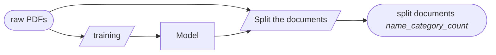
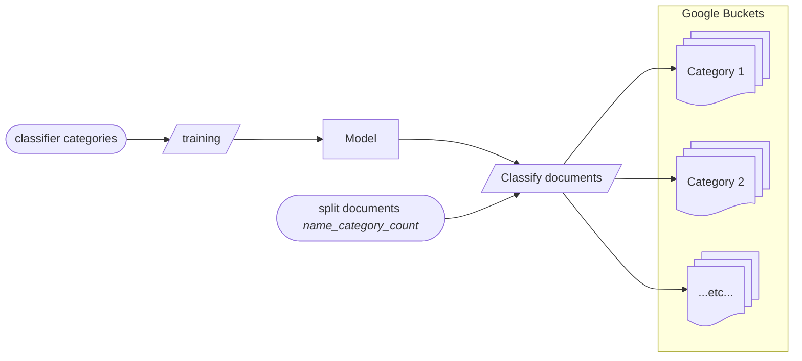
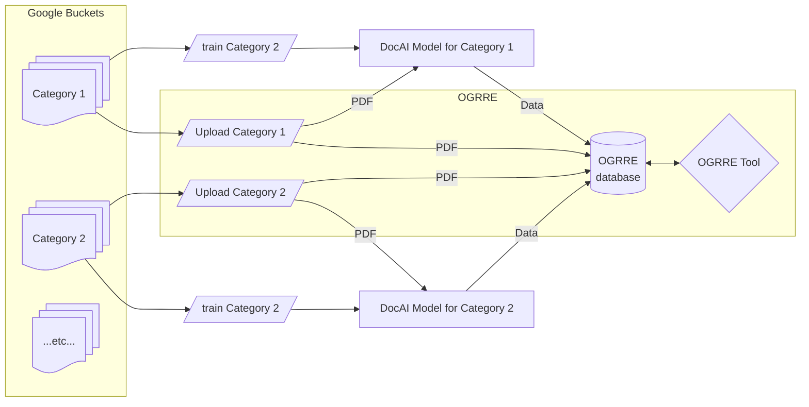

# How Document Processing Works

## Introduction

OGRRE currently uses [Google Document AI (DocAI)](https://cloud.google.com/document-ai),
a commercial cloud service, for digitizing documents.

This page describes the workflow used to process well records through DocAI.

## Terminology

Following are terms used in this page:

|Term|Synonyms|Definition|
|----|--------|----------|
|model|AI model|Trained (DocAI) model that can transform inputs to outputs|
|collated documents|Raw PDFs|Multiple-page PDFs containing well records|
|splitter||AI model that can extract the PDF pages from collated documents|
|category||A label that identifies a type of document|
|training document||Document used to train an AI model|
|testing document||Document used to assess the accuracy of the AI model as part of the model training|
|classifier||AI model that groups documents into categories for processing|
|schema||Set of attributes that are expected for a document in a given category|
|field|attribute|One named value in a document|

## Overview

Below is a diagram showing an overview of the workflow.

The basic three steps, each of which require training the service, are:
* **Split**: Separate the pages with information from the rest. Historical documents may have
hundreds of pages, only a handful of which have the desired information. We train a *splitter* that can extract only
the necessary pages. This step saves a large amount of data transfer, storage, and processing time, as all future
steps work only with the subset of pages split out of the raw input.

* **Classify**: Break documents into *categories*. Document formats vary widely. To improve the precision and accuracy of the data extraction,
we first train a *classifier* to recognize several categories of similar documents. The trained *classifier* can then sort the records into 
Google "buckets".

* **Extract**: Each document category, corresponding to a Google bucket, is trained separately to extract the fields specified in the shared *schema*.
The results of this step are displayed, along with the document PDF (reduced to relevant pages by the *splitter*) in the OGRRE tool for manual correction.

## Detailed Description

### Split

Typical input documents are multiple page PDFs, only some of which contain the data of interest.
Different categories of report document have different boundaries, so they are labeled and identified.

#### Training
The training set is created with the following manual (human) steps, performed on the collated raw PDFs uaing the Google DocAI web interface:
1) Identify the document boundaries
2) Assign a category, based on titles or content, to separate different collated document types

Google DocAI needs at least 10 training documents and 2 testing documents for each category to automatically
apply the categories and boundaries to the rest of the collated documents.

#### Application
This 'model' of document boundaries and categories can now be applied to the rest of the collated documents.
Then the processing workflow produces files like:
`{original file name}_{Splitter label}_{Label count}`.

* A useful original file name is the API number (e.g., if not inside the file itself)
* The "Label count" tracks the number of documents with the same “Splitter Label” for a given collated Document

### Classify

Once the documents have been split so that only the pages with the desired data are present,
they need to be grouped into categories based on document layout.

#### Training
Classifier category labels are based on the order of when each document type was identified, 
using letters as follows: `{Splitter Label}_{A,B,C,..}`.
Each document receives one label.

The training set is created by labeling document types. As for the Split step, Google DocAI needs at least
10 training and 2 testing documents for each document type.

#### Application
The classifier model takes as input the splitter outputs from the previous step
and categoriezs them into different schema label "bins", which are mapped to different Google buckets for extraction.

### Extract

The final step in the workflow is to extract the data from each category of documents.
To do this, one must first train the processor, adding schema (field) labels for every field in the category of documents.

#### Training

Unlike the Split and Classify steps for a field to included in a model, Google DocAI needs the field to be included on at least 10 training and 10 testing documents to create a model.
One model is trained for each category identified in the previous Classify step.

Some important things to keep in mind for this process:
* Field labels matching the document text reduces incorrect auto-labeling.
* Field labels may also be included into tables to facilitate grouping tabular data.
* Unless otherwise required, the occurrence setting for fields inside of tables should be `once`.
* Documents that have a field labels with the occurrence setting `required` will be excluded from training if that field cannot be detected.
* Field labels that may occur more than once should have the occurrence setting `multiple`.
* Keeping a record of the field labels, label type, occurrence, field groupings, and page order is best practice.
    * When training new models recording the fields that are disabled.

Below are details on the labeling process in Google DocAI:
* Upon opening a document, Google attempts to auto-label any unconfirmed field colored in purple.
* Confirm field bounding boxes that are in the correct position.
* Edit field bounding boxes that are in the wrong position.
* Add field bounding boxes that are missed.
* Bounding boxes must include detected “text”, Document with empty bounding boxes will be excluded from training.
* Extracted text in the labeling process should not be edited. 
    * The text reader is not part of the model training process.
    * Bounding boxes with edited text will be treated as incorrect detections during model testing in correctly reducing the accuracy of the model.

#### Application
The completed models are applied, in batch mode, with a script that is tied to the OGRRE tool. This process involves 2 steps:
1. Before running the script, create a mapping between the trained model and the documents for which it is intended (which correspond to a Google bucket)
2. The script takes this mapping and runs the Google DocAI processor to generate digitized data for each, storing the results in the tool database.

The combination of the document image (PDF) and digitized data are used by OGRRE to provide the interface for reviewing and correcting the digitized data.
