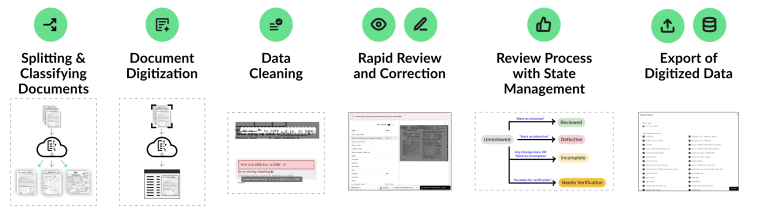

# Summary

The Oil and Gas Regulatory Record Digitizer (OGRRE) is an open-source, web-based, intelligent document processing (IDP) platform that converts images of scanned documents into structured datasets ready for analysis or import into a relational database. OGRRE was originally designed for teams assembling accurate information from scanned images of historical oil and gas well records that contain information not represented in modern oil and gas databases; however, the scope is expanding to consider any energy record. OGRRE is designed to execute an entire IDP pipeline, including document splitting and classification, text extraction, human-in-the-loop review, and data export [Figure 1]. The platform connects external document-processing models and custom data cleaning functions with a graphical user interface (UI) where users can upload records, review extracted values alongside source documents, correct errors, and export validated data in a variety of formats. Users can also set document review statuses, take notes, and elevate issues to a supervisor, which facilitates project management. In the current deployment, IDP capabilities are provided by Google Document AI processors, while OGRRE supplies the project, record, schema, review, and export workflows. 

Figure 1: Capability overview of the Oil and Gas Regulatory Record Digitizer (OGRRE).

# Statement of need

Oil and gas wells and other deep engineered boreholes are the primary mechanism through which we access the subsurface to produce hydrocarbons, store energy, and dispose of wastes. To date, millions of wells have been drilled, many of which intersect reservoirs that are valuable for future subsurface energy projects [@gasda2004,@nicot2008]. Drilling a well generates a vast quantity of data that describes not only the well itself, but the formations it penetrates. While much of the data generated are proprietary, many jurisdictions have permitting and reporting requirements that result in the submission of drilling and operational information [@omalley2024,@ma2024]. This information includes, but is not limited to, well construction records, geophysical logs, and produced fluid geochemistry [@lackey2026,@mackey2024].   

State agencies such as oil and gas regulators and geological surveys are typically responsible for curating well records. While many agencies have migrated their permitting processes to electronic platforms that automate the transfer of submitted information to databases, most jurisdictions with a long history of oil and gas development continue to maintain millions of paper records that detail historical operations. Efforts to scan these records and make them available to the public online have been ongoing for many years and images of key records are often available. State agencies and commercial companies have also digitized important information for wells such as their location, operator, and production history. Despite these efforts, most well data remain trapped in digital or analog documents, which differ substantially in quality and format. Consequently, researchers, operators, and agency personnel may need to inspect and transcribe large collections of well information to perform even basic analysis of well information. Thus, there is a need to bridge the gap that exists between the information in scanned well records and structured research-ready datasets.  

OGRRE is an IDP platform that was designed to address these gaps by facilitating the extraction of structured data from scanned images of well records. Human-in-the-loop review is the primary focus of the OGGRE user interface because document scans vary widely in quality and data accuracy is a high-priority for stakeholders working with well information. Inside the user interface, document reviewers can clean extracted data with custom cleaning functions, select fields to see their locations in the source image, edit values that were incorrectly extracted, add additional fields that were missed, assign document review status, retain notes, embed extracted data in PDFs, and export data in multiple formats. These capabilities supports a transparent document processing workflow in which the accuracy of machine-generated results is verified by human reviewers before it is used for research purposes or transmitted to an agency database.

The target users of OGRRE are teams working with historical regulatory, geological, or engineering well records. OGRRE is developed by the Department of Energy's Consortium Advancing Technology for Assessment of Lost Oil & Gas Wells (CATALOG) [@energyCATALOGx2013], a collaboration involving Lawrence Berkeley, Los Alamos, Sandia, and Lawrence Livermore National Laboratories together with the National Energy Technology Laboratory. The source code, deployment configuration, and user documentation are available from the [project repository](https://github.com/CATALOG-Historic-Records/orphaned-wells-ui). The software is consequently focused on a practical research need: making heterogeneous historical records usable for downstream scientific and public-interest analysis.

# State of the field

There are many commercial and open-source IDP software tools available. Companies such as ABBYY [@abbyy], Docparser [@docparser], and Hyland [@hyland] offer enterprise software that contains entire IDP workflows including document splitting, classification, text extraction, human-in-the-loop review, and data export. Cloud service providers such as Google [@googleDocumentAI], Amazon [@aws_textract], and Microsoft [@microsoft_azure_doc_intelligence] also offer application programming interfaces (APIs) for proprietary document processing models that can be used to develop custom web-based IDP software. Both enterprise software and cloud-based IDP models traditionally rely on the manual labeling of documents and document fields to fine tune pre-trained models focused on document splitting, classification, or data extraction. In recent years, advancements in frontier multimodal large language models (LLMs) such as ChatGPT [@chatgpt2026], Claude [@claude2026], and Gemini [@gemini2026], have made structured data extraction from document images less cumbersome by removing the need for labeling. However, LLMs alone do not offer a complete IDP workflow. To address this, companies like Unstract [@unstract] have built platforms that leverage multimodal large language models within an IDP pipeline. 

A wide variety of open source document processing tools exist. However, these tools predominantly focus on single steps of an IDP workflow. For example, doc-split-v1 [@nutrientdocs2026docsplitv1] and DiT [@li2022dit] are used for document splitting and classification, respectively. Tesseract [@smith2007overview], easyOCR [@easyocr], and Paddle OCR [@cui2025paddleocr], are traditional open source OCR models that return digitized text from a page. Docling [@Docling] reads and parses text to identify tables and other key document structures. LayoutLMv3 [@huang2022layoutlmv3] and Donut [@kim2022ocr] extract field-value pairs from documents using manually labeled OCR outputs and page-specific JSON, respectively. Open-source multimodal models such as Qwen [@qwen2vl] and DeepSeek-OCR [@wei2026deepseekocr2] also provide structured text extraction capabilities. There are also support tools like Label Studio [@LabelStudio], which facilitates the creation of manual labels for documents that can be used to train text-extraction models. No major open source solutions currently exist for human-in-the-loop review, likely due to the variability between documents and the custom needs of users.

OGRRE is a custom IDP web platform designed to facilitate structured text extraction from publicly available oil and gas records. In the landscape of IDP tools, OGRRE is most similar to commercial enterprise IDP software as it is designed to perform an entire IDP workflow including document splitting, classification, text extraction, human-in-the-loop-review, and data export. Currently, there is no open source option that integrates key IDP capabilities into one platform. While OGRRE is currently designed to use proprietary models offered by Google Document AI for IDP functions, open source alternatives for these functions are under development. OGRRE is also the only open source tool with custom features like data cleaning functions that were designed for oil and gas records. The human-in-the-loop review interface and document management systems are also unique among open source tools.

# Software design

OGRRE is implemented as a ReactJS [@reactjs] and TypeScript frontend. The frontend communicates with a server written in Python using the FastAPI framework, backed by a MongoDB [@mongodb] database. The interface, API, and persistence layers can be deployed independently. The repository includes Docker Compose [@dockerCompose] configuration for running the frontend, backend, and database together during development, as well as deployment configurations for Google Cloud. This architecture reflects a balance between accessibility for users and operational requirements for teams processing documents at scale.

The central data model organizes records into projects and record groups and associates each record with its source document, extracted attributes, confidence values, and review state. Processor definitions and schemas are managed through the interface, so a project can represent the fields expected for a particular document type without changing the application code. Users can upload individual files or directories, optionally run configured cleaning functions, and export selected fields as comma separated values (CSVs), Javascript Object Notation (JSON), and embedded portable document format (PDF) files. JSON export retains additional metadata such as confidence values, while CSV supports common analysis and spreadsheet workflows.

The document-processing workflow is broken into a four-stage workflow, with the first three stages performed by Python scripts and interaction with the AI processing tools (currently, Google Document AI [@googleDocumentAI]). A _splitter_  identifies document boundaries in collated PDFs; a _classifier_ assigns documents to categories; and an _extractor_ finds and extracts field-value pairs for each category. The resulting fields and values are stored in the OGRRE database for review by the OGRRE UI. Separating these stages provides flexibility and aligns with the workflow expected by both the current Google Document AI and future open-source AI document processing workflows. Finally, users of the OGRRE UI _review_ the documents [Figure 2] and can export results in standard formats. The document-processing workflow in OGRRE is designed to separate the responsibilities of the development team, which implements the _splitters_, _classifiers_, and _extractors_, from the review teams, which reviews and verifies the records.

The OGRRE UI emphasizes review efficiency. Extracted fields and values are displayed alongside the source document, selecting a field shows its location on the image, values can be sorted based on model confidence, and keyboard shortcuts support movement through records. Document review statuses can also be assigned by reviewers to manage projects. Document statuses include unreviewed, incomplete, reviewed, and defective, which make the state of a document visible to collaborators. Thus, the OGGRE UI favors the traceability and collaborative correction of documents over a fully automated but opaque pipeline.

Figure 2: OGRRE UI. This screen shows review of a document. The fields on the left show extracted field-value pairs, which can be edited by a person and saved to the database. As fields are selected on the left, the corresponding bounding box detected by the AI processing are highlighted in the image on the right. Document review statuses can be set using buttons at the bottom of the page. Numerous keyboard shortcuts allow for navigation through a list of documents.

# Research impact statement

OGRRE is used by multiple oil and gas industry stakeholders in collaboration with the joint Lawrence Berkeley National Laboratory and National Energy Technology Laboratory team, and the repository provides deployment configurations for the various collaborator-specific instances. Its documentation includes a complete workflow for configuring processors, uploading and reviewing records, updating schemas, and exporting data, as well as a Docker-based development stack and Google Cloud deployment guidance. These materials provide a basis for reproducible adoption by research teams with comparable document-digitization needs.

The immediate research value of OGRRE is its ability to provide reliable data for orphaned well locations and construction details, which inform field efforts and data analyses focused on finding and characterizing orphaned wells. In particular, the platform can help connect information extracted from historical records with later analyses of well locations, construction, and production history. To date, the data processed with OGRRE have been ingested into databases managed by the CATALOG team and state agency partners.

# AI usage disclosure

Generative AI **[Chat GPT 5.4-mini]** was used to assist with the preparation of this draft paper. The generated text was based on `info.txt`, the OGRRE documentation, the public source repository, and the JOSS paper-format guidance. The paper was reviewed and edited by the authors to ensure the accuracy of the content. Generative AI tools **[Chat GPT 5.5, 5.6, and 6 and Gemini 3.6 Flask]** were also used for software development. The authors conducted rigorous manual code reviews, verified the logic, and implemented a comprehensive automated test suite to ensure the technical integrity of AI-generated contributions. 

# Acknowledgements

This work was supported as part of the Consortium Advancing Technology for Assessment of Lost Oil & Gas Wells, funded by the Undocumented Orphan Well Program in the Office of Oil and Natural Gas within the Hydrocarbon and Geothermal Energy Office of the U.S. Department of Energy. Parts of this work were performed under the auspices of the U.S. Department of Energy by Lawrence Berkeley National Laboratory under Contract DE-AC02-05CH11231.

# References
